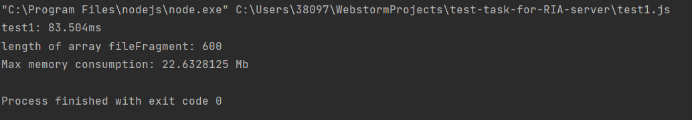

<h1>Деякі роздуми про читання стрічок з файлу</h1>

Підчас виконання даного завдання з'явилася необхідність вичитувати з текстового файлу окремі його стрічки.
Відверто кажучи, раніше я не робив подібного засобами JS. 

Варіант вирішення цього завдання "в лоб": прочитати увесь файл, розпарсити стрічки в масив і взяти необхідний зріз 
масиву стрічок.

Але досвід роботи з Python і логіка підказали мені, що 
оптимальним варіантом буде читання не всього файлу, а лише необхідних стрічок (в Python для цього є досить зручний метод).

На жаль я не зміг знайти подібного засобу в JS (який би читав необхідні стрічки а не усі підряд).
Спробував реалізувати те, що мені потрібно використовуючи почергове зчитування стрічок з файлу і для власного спокою 
перевірити швидкодію цього методу (я підозрював, що моя реалізація може дещо поступатися в швидкодії варіанту "в лоб").

На моє здивування вона поступалася не трохи, а суттєво - у 20-30 разів.

Але ж... Мій варіант, певно, має бути економніший у відношенні витрат пам'яті, адже ми не оперуємо цілим файлом, а лише 
його частинами?..

Як показали тести - знову мімо. В цілому варіант "в лоб" використовує приблтзно на 10% менше пам'яті.

Такі результати, скоріш за все, пов'язані з тим, що я реалізував пострічкову вичитку не оптимально. Однак, моїх навичок 
поки що не достатньо для того, щоб в прийнятні строки це виправити. Тому поки що залишу варіант "в лоб".

P.S. З дійсно великими файлами (в яких кількість стрічок виміряється не тисячами, а десятками і сотнями мільньонів) 
ситуація може кардинально змінитися, але для даного текстового файлу результати такі. 

Додаток:
Результати тестів:

Тест1: Построкове зчитування

Тест2: Зчитування всього файлу і його парсинг

